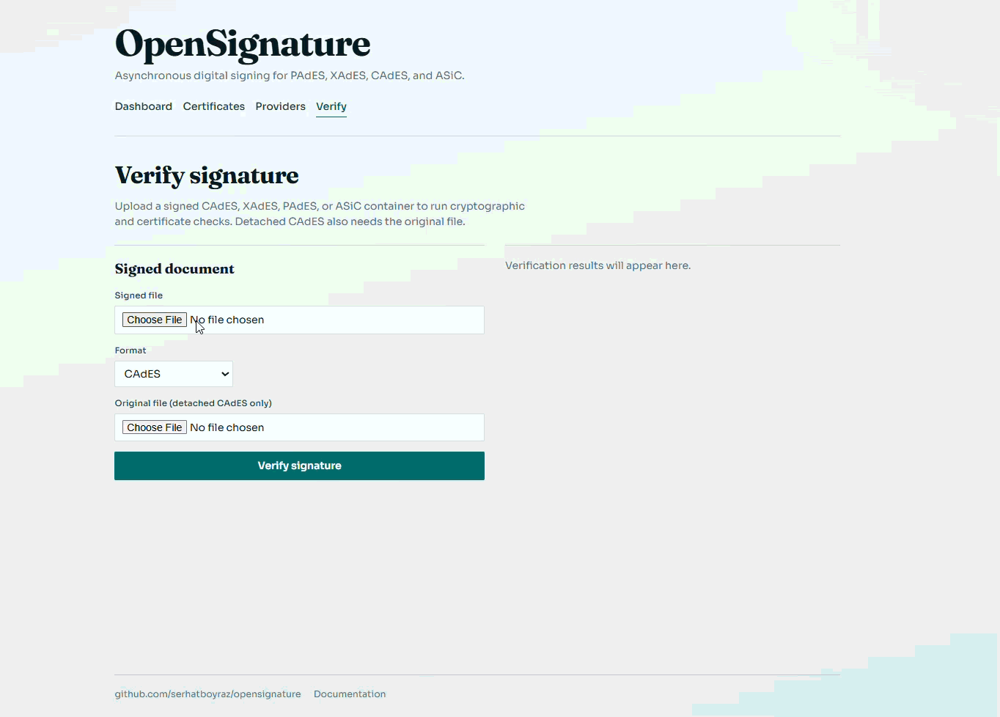
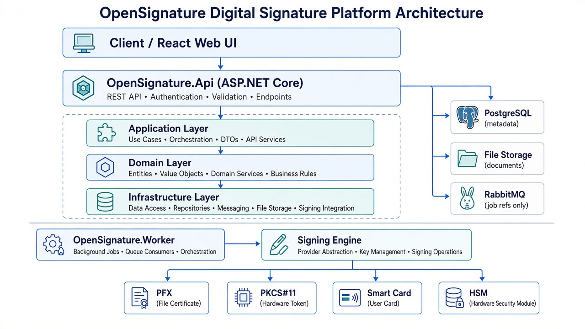
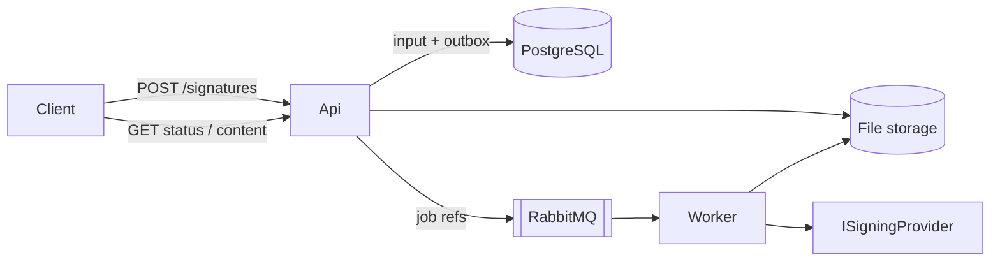

# OpenSignature

Independent .NET digital-signature platform with asynchronous signing, PostgreSQL metadata, RabbitMQ workers, and a React administration UI.

Bağımsız .NET dijital imza platformu: asenkron imzalama, PostgreSQL meta veri, RabbitMQ işçileri ve React yönetim arayüzü.

---

## See it in action / Nasıl çalışır

Walkthrough GIFs of the OpenSignature web UI live in [`assets/`](assets/). They show creating an asynchronous signature and verifying the signed file.

OpenSignature web arayüzünün adım adım kayıtları [`assets/`](assets/) klasöründedir. Asenkron imza oluşturmayı ve imzalı dosyayı doğrulamayı gösterirler.

### Create a signature / İmza oluşturma

Upload a document, choose format, profile, and provider, then submit. The session list polls until the job moves from **Pending** to **Completed**.

Belgeyi yükleyin; biçim, profil ve sağlayıcıyı seçip gönderin. Oturum listesi iş **Pending** durumundan **Completed** olana kadar yoklar.


### Verify a signature / İmza doğrulama

On **Verify**, upload a signed CAdES, XAdES, PAdES, or ASiC file and run cryptographic and certificate checks (detached CAdES also needs the original file).

**Verify** sayfasında imzalı CAdES, XAdES, PAdES veya ASiC dosyasını yükleyip kriptografik ve sertifika kontrollerini çalıştırın (ayrık CAdES için orijinal dosya da gerekir).



---

## Architecture / Mimari






| EN | TR |
| --- | --- |
| API validates, stores the file, writes an outbox row, returns `202 Accepted` | API doğrular, dosyayı kaydeder, outbox yazar, `202 Accepted` döner |
| Worker consumes a small RabbitMQ message (never document binaries) | Worker küçük RabbitMQ mesajını tüketir (belge ikilisi yok) |
| Hardware providers sign digests on-device; private keys are never exported | Donanım sağlayıcıları özeti cihazda imzalar; özel anahtar dışa aktarılmaz |

Async pipeline:


---

## Documentation / Dokümantasyon

| English | Türkçe |
| --- | --- |
| [MkDocs site (EN)](docs/en/index.md) | [MkDocs sitesi (TR)](docs/tr/index.md) |
| [Product specification](docs/PRODUCT-SPEC.en.md) | [Ürün spesifikasyonu](docs/PRODUCT-SPEC.tr.md) |
| [Architecture](docs/en/architecture.md) | [Mimari](docs/tr/architecture.md) |
| [Flows & diagrams](docs/en/flows.md) | [Akışlar ve diyagramlar](docs/tr/flows.md) |
| [REST API](docs/en/api.md) | [REST API](docs/tr/api.md) |
| [Security](docs/en/security.md) | [Güvenlik](docs/tr/security.md) |
| [Operations](docs/en/operations.md) | [Operasyon](docs/tr/operations.md) |
| [Task checklist](docs/TASKS.md) | [Görev listesi](docs/TASKS.md) |

Build the bilingual docs site:

```bash
pip install -r requirements-docs.txt
mkdocs serve
```

Open http://127.0.0.1:8000 and use the language switcher (**English** / **Türkçe**). Config: [`mkdocs.yaml`](mkdocs.yaml).

All source code, identifiers, logs, tests and commit messages are English-only.  
Kaynak kodu, tanımlayıcılar, loglar, testler ve commit mesajları yalnızca İngilizcedir.

---

## Prerequisites / Önkoşullar

- .NET 10 SDK
- Node.js 20+
- Docker (PostgreSQL + RabbitMQ)

## Local infrastructure / Yerel altyapı

```bash
cp .env.example .env
docker compose up -d
docker compose ps
```

Defaults: Postgres `localhost:5432` (`esign`/`esign`/`opensignature`), RabbitMQ `5672` + management UI `15672`. If host port `5432` is busy, set `POSTGRES_PORT=5433` in `.env` and match `ConnectionStrings:PostgreSQL` in the Api/Worker Development settings.

## Start development apps / Geliştirmeyi başlatma

One command starts Docker dependencies, the API, the signing worker, and the React UI:

```bash
pwsh ./scripts/Start-Development.ps1
```

| App | URL |
| --- | --- |
| Web | http://localhost:5173 |
| API | http://localhost:5270 |

Press Ctrl+C in that terminal to stop the API, worker, and web processes. Containers stay up until `docker compose down`.

Optional flags: `-SkipInfrastructure`, `-SkipCertificate`, `-ApiProfile https`.

## Working POC (async signing) / Çalışan POC

```bash
# 1) Dependencies
docker compose up -d

# 2) Dev signing certificate (gitignored under data/certs/)
pwsh ./scripts/Generate-DevCertificate.ps1
$env:Signing__Pfx__Password = "opensignature-dev"

# 3) Build and run (two terminals)
dotnet build OpenSignature.slnx
dotnet run --project src/OpenSignature.Api --launch-profile http
dotnet run --project src/OpenSignature.Worker
```

API: http://localhost:5270

Create a Baseline-B signature (CAdES example):

```bash
curl -s -X POST "http://localhost:5270/api/v1/signatures" \
  -H "X-Tenant-Id: tenant-demo" \
  -H "Idempotency-Key: demo-1" \
  -F "file=@samples/poc.txt;type=text/plain" \
  -F "format=CAdES" \
  -F "profile=B" \
  -F "signingProvider=Pfx"
```

Poll status, then download when `Completed`:

```bash
curl -s "http://localhost:5270/api/v1/signatures/{id}" -H "X-Tenant-Id: tenant-demo"
curl -s -o signed.bin "http://localhost:5270/api/v1/signatures/{id}/content" -H "X-Tenant-Id: tenant-demo"
curl -s "http://localhost:5270/api/v1/signatures/{id}/verification" -H "X-Tenant-Id: tenant-demo"
```

Ad-hoc verification of an already-signed file:

```bash
curl -s -X POST "http://localhost:5270/api/v1/verifications" \
  -H "X-Tenant-Id: tenant-demo" \
  -F "file=@signed.bin;type=application/pkcs7-mime" \
  -F "format=CAdES"
```

Supported MVP formats: **CAdES-B**, **XAdES-B**, **PAdES-B** via the development PFX provider. Sample inputs live under `samples/`.

USB tokens appear on the Providers page (`/providers`) when vendor PKCS#11 middleware is installed. Development auto-detects well-known libraries (`Signing:SmartCard:AutoDetect`). Expired token certificates can sign in Development via `Signing:AllowExpiredCertificates` (keep this `false` in production). See [Operations](docs/OPERATIONS.md) / [Operasyon](docs/tr/operations.md).

## Tests / Testler

```bash
dotnet test OpenSignature.slnx
```

## Repository layout / Depo düzeni

```text
src/OpenSignature.Api|Application|Domain|Infrastructure|Signing|Signing.Contracts|Validation|Worker|Web
tests/
docs/                 # engineering sources + MkDocs (en/, tr/, assets/)
assets/               # UI walkthrough GIFs (signing + verification)
mkdocs.yaml
scripts/Start-Development.ps1
scripts/Generate-DevCertificate.ps1
samples/
```

## Status / Durum

POC path is operational: API → storage → PostgreSQL → outbox → RabbitMQ → worker → signing engine → download. USB-token PKCS#11 providers are registered from configuration (auto-detect in Development). Further work continues via `docs/TASKS.md`.

POC yolu çalışır durumda: API → depolama → PostgreSQL → outbox → RabbitMQ → işçi → imza motoru → indirme. USB-token PKCS#11 sağlayıcıları yapılandırmadan kaydedilir (Development’ta otomatik algılama). Sonraki işler `docs/TASKS.md` üzerinden sürer.
