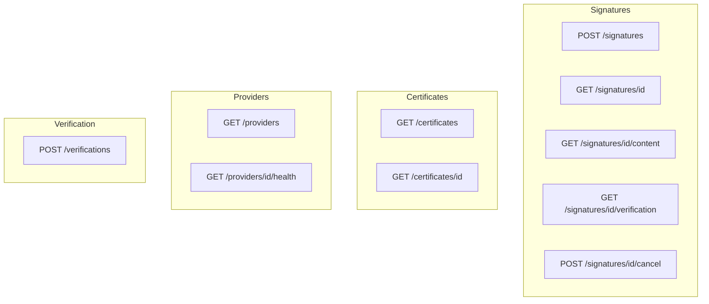
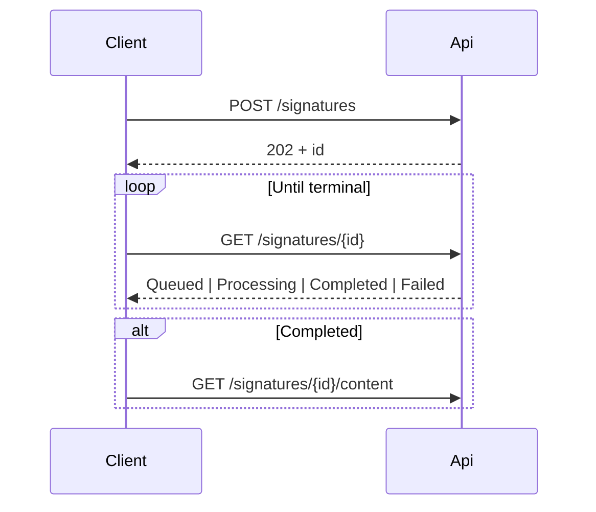

# REST API

Base path: `/api/v1`  
OpenAPI (Development/Testing): `GET /openapi/v1.json`

Cryptographic signing never runs inside the API. Create returns **`202 Accepted`**; the worker completes the job asynchronously.

## Common headers

| Header | Required | Description |
| --- | --- | --- |
| `Authorization` / `X-Api-Key` | When auth enabled | `Authorization: ApiKey <key>` or `X-Api-Key` |
| `X-Tenant-Id` | Recommended | Tenant scope |
| `Idempotency-Key` | Recommended on create | Replay-safe create |
| `X-Correlation-Id` | Optional | Propagated into logs and status |

## Error model (RFC 7807)

```json
{
  "type": "https://httpstatuses.com/400",
  "title": "Invalid request",
  "status": 400,
  "detail": "A non-empty 'file' form field is required.",
  "errorCode": "SIGNATURE_REQUEST_INVALID",
  "traceId": "..."
}
```

| Code | Typical status |
| --- | --- |
| `SIGNATURE_REQUEST_INVALID` | 400 / 413 |
| `SIGNATURE_FORMAT_UNSUPPORTED` | 400 |
| `SIGNATURE_PROFILE_UNSUPPORTED` | 400 |
| `SIGNING_PROVIDER_UNAVAILABLE` | 400 |
| `SIGNING_CERTIFICATE_NOT_FOUND` | 400 |
| `SIGNING_CERTIFICATE_EXPIRED` | 422 / job failure |
| `SIGNATURE_INPUT_NOT_FOUND` | 404 |
| `SIGNATURE_OUTPUT_NOT_FOUND` | 409 |
| `SIGNATURE_NOT_CANCELLABLE` | 409 |
| `SIGNATURE_ALREADY_COMPLETED` | 409 |
| `TIMESTAMP_AUTHORITY_UNAVAILABLE` | job failure |
| `SIGNATURE_VALIDATION_DATA_UNAVAILABLE` | job failure |

## Endpoints overview



### POST `/api/v1/signatures`

Multipart fields: `file`, `format`, `profile`, `signingProvider`, optional `certificateThumbprint`, PAdES appearance fields (`visibleSignature`, `signatureNote`, `signaturePage`, `signatureImage`).

Formats: `PAdES`, `XAdES`, `CAdES`, `ASiC_S`, `ASiC_E`  
Profiles: `B`, `T`, `LT`, `LTA`  
Providers: `Pfx`, `Pkcs11`, `SmartCard`, `Hsm`

Response `202`:

```json
{
  "id": "0198...",
  "status": "Queued",
  "createdAt": "2026-09-05T17:00:00Z",
  "statusUrl": "/api/v1/signatures/0198..."
}
```

### GET `/api/v1/signatures/{id}`

Status polling. Incomplete outputs are never exposed as completed.

### GET `/api/v1/signatures/{id}/content`

Streams `signed.bin` when **Completed**.

### GET `/api/v1/signatures/{id}/verification`

JSON validation report for a completed stored signature.

### POST `/api/v1/signatures/{id}/cancel`

Reliable only before signing starts.

### Certificates & providers

- `GET /api/v1/certificates` — public certificate metadata only (never private keys)
- `GET /api/v1/providers` / `.../health` — provider discovery and health

### POST `/api/v1/verifications`

Ad-hoc upload verification (not persisted).

## Client poll loop



Full field-level contract: [engineering API source](engineering/api.md).
