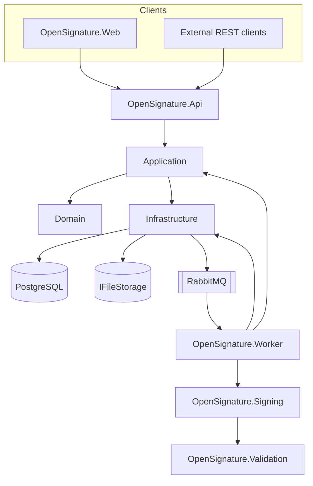
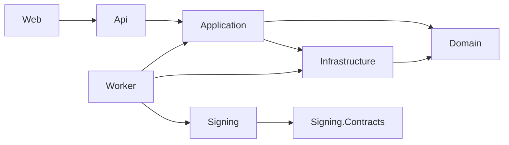
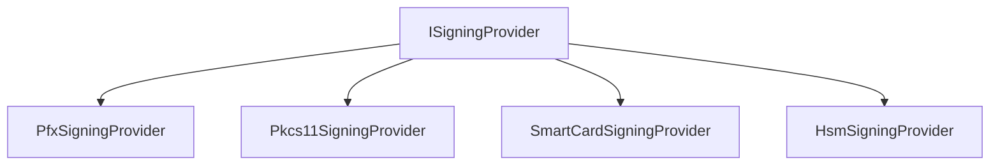
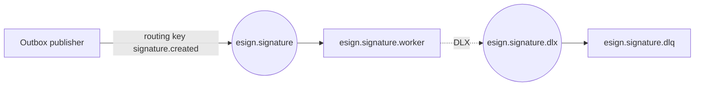

# Architecture

Engineering architecture for **OpenSignature**. Authoritative product rules live in the [product specification](product-spec.md) and `docs/TASKS.md`.

{ .architecture-hero }

## Goals

- Formats: PAdES, XAdES, CAdES, ASiC-S, ASiC-E (profiles B → T → LT → LTA).
- API never signs synchronously.
- Cryptography behind replaceable `ISigningProvider` implementations.
- Binaries in file/object storage; PostgreSQL holds metadata, jobs, audit, outbox.
- RabbitMQ transports job references only.
- Tenant isolation, idempotency, OpenTelemetry end-to-end.

## Component map

| Project | Role |
| --- | --- |
| `OpenSignature.Web` | React admin / demo UI |
| `OpenSignature.Api` | HTTP boundary; validate; `202 Accepted` |
| `OpenSignature.Application` | Use cases, DTOs, ports |
| `OpenSignature.Domain` | Entities, state machine — no infrastructure |
| `OpenSignature.Infrastructure` | EF Core, PostgreSQL, storage, RabbitMQ, outbox |
| `OpenSignature.Signing.Contracts` | `ISigningProvider` and shared contracts |
| `OpenSignature.Signing` | Providers and format engines |
| `OpenSignature.Validation` | Certificate + signature validation reports |
| `OpenSignature.Worker` | Consume jobs; sign; update state |



## Dependency rules



- **Domain** depends on nothing outside itself.
- **Signing** must not depend on RabbitMQ.
- **Api** must not perform cryptographic signing.
- Prefer ports: `IFileStorage`, `ISigningProvider`, messaging abstractions.

## Signing providers



Hardware rule:

```text
certificate → digest → device.Sign(digest)
```

Private keys never leave the token/HSM. PFX is development/demo only.

## Storage keys

Server-generated (never client filenames):

```text
tenants/{tenantId}/signatures/{yyyy}/{MM}/{dd}/{signatureId}/input.bin
tenants/{tenantId}/signatures/{yyyy}/{MM}/{dd}/{signatureId}/signed.bin
```

## RabbitMQ topology



Messages carry `jobId`, `tenantId`, `signatureId`, storage paths, format/profile, attempt — **not** file bytes.

## Outbox pattern

1. Same PostgreSQL transaction: signature metadata + job + `OutboxMessage`.
2. Publisher drains unpublished rows to RabbitMQ.
3. Mark published only after broker handoff.
4. Worker consumption is idempotent (job lock + terminal-state checks).

## Multi-tenancy

- Entities and messages include `TenantId`.
- Idempotency key = `TenantId + Idempotency-Key`.
- Auth roadmap: MVP API keys; production OAuth2/OIDC + JWT + RBAC.

## Observability

Every hop should carry `correlationId`, `traceId`, `signatureId`, `jobId`.

Key metrics: request/completion/failure totals, duration, queue wait, RabbitMQ retries, provider failures, storage operations.

Never log private keys, PINs, passwords, secrets, or document contents.

## Related

- [Flows & diagrams](flows.md)
- [Security](security.md)
- [Engineering architecture source](engineering/architecture.md)
