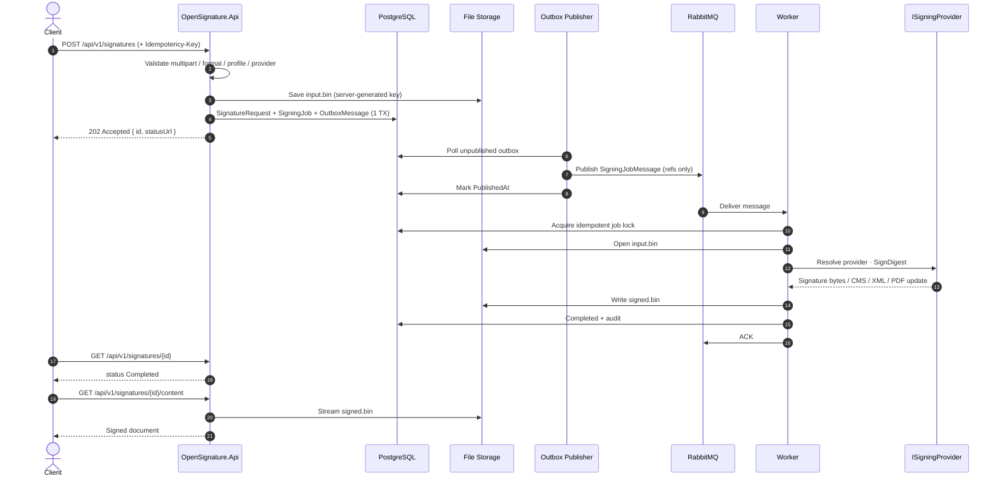
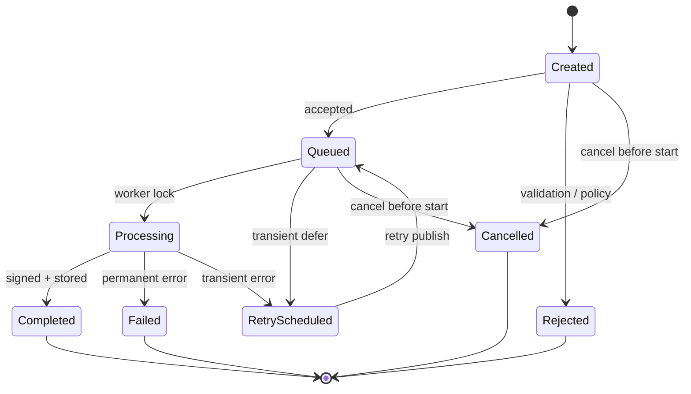
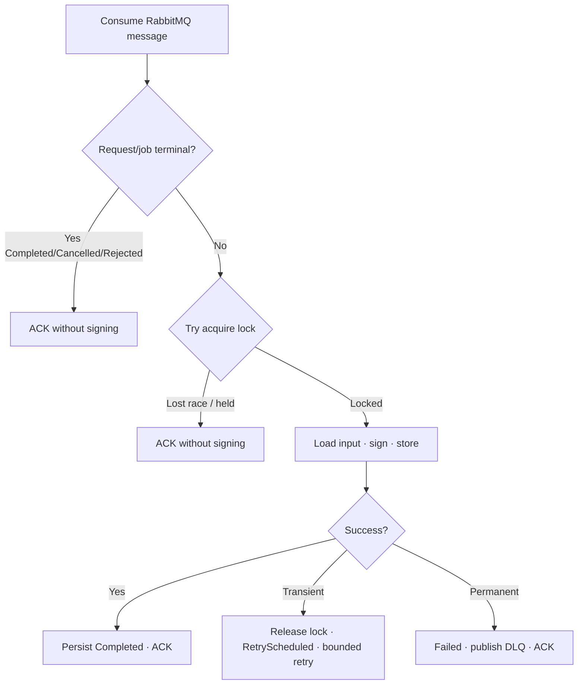
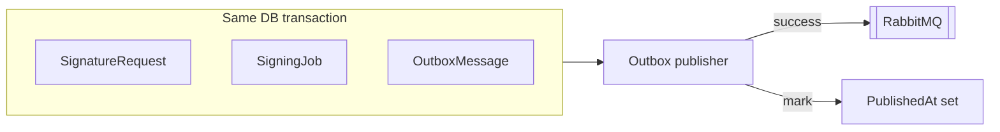
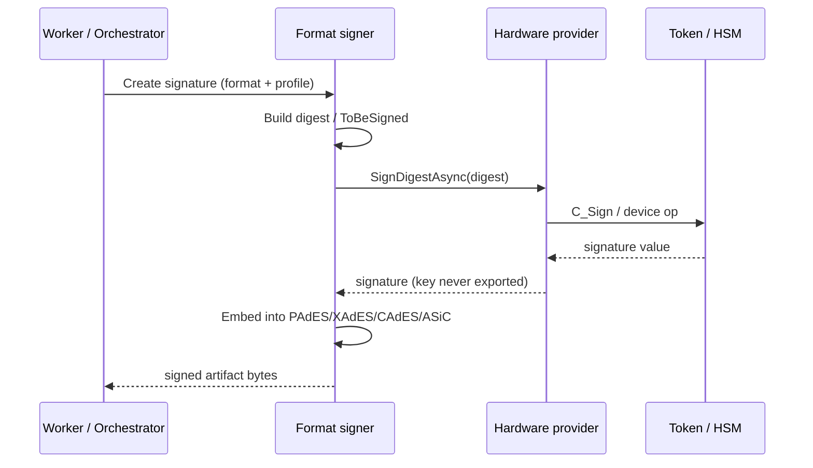
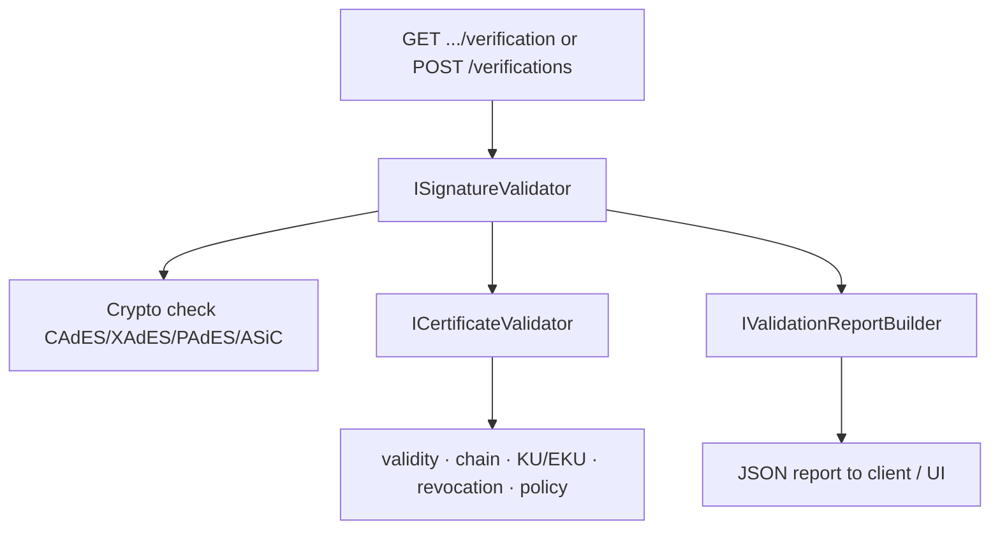

# Flows & diagrams

Visual reference for OpenSignature request processing, state machines, outbox reliability, and provider signing.

{ .architecture-hero }

## End-to-end signing sequence

## Signature request state machine

Terminal states: **Completed**, **Failed**, **Rejected**, **Cancelled**.

## Worker job lock & idempotency

Rules:

- At-least-once delivery must not produce duplicate successful signatures.
- Lock lease must exceed expected signing duration (default 15 minutes).
- Expired `Locked`/`Processing` may be reclaimed after crash; active locks are not stolen.

## Outbox reliability

Avoids dual-write loss between PostgreSQL and the broker.

## Provider digest-sign flow

## Verification flow

## Retry vs DLQ

| Failure class | Behavior |
| --- | --- |
| Transient (network, TSA timeout, lock contention) | Exponential backoff; bounded `MaxAttempts` |
| Permanent (bad payload, crypto failure, unreadable PDF) | DLQ immediately; no endless retry |

DLQ: `esign.signature.dlq` via `esign.signature.dlx`.
