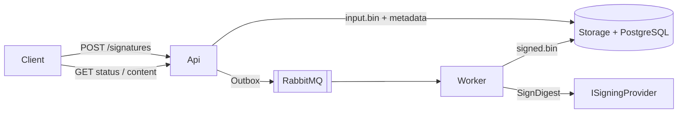

# OpenSignature

**OpenSignature** is an independent .NET digital-signature platform for enterprise PAdES, XAdES, CAdES, and ASiC workflows. Clients submit documents over REST; workers sign asynchronously. PostgreSQL stores metadata; file storage holds binaries; RabbitMQ carries job references only.

{ .architecture-hero }

System overview — API, storage, queue, worker, and signing providers.

## Why this architecture

| Principle | Practice |
| --- | --- |
| Non-blocking API | Validate → store → outbox → `202 Accepted`. No crypto in the API process. |
| Safe transport | RabbitMQ messages are small JSON job refs — never document binaries. |
| Key hygiene | Hardware providers sign digests on-device; private keys are never exported. |
| Tenant isolation | Storage keys, idempotency, and queries are scoped by `TenantId`. |
| Observable | Correlation / trace / signature / job IDs on every hop. |

## Quick links

- [Getting started](getting-started.md) — local Docker, API, worker, UI
- [Architecture](architecture.md) — components and dependency rules
- [Flows & diagrams](flows.md) — sequence and state diagrams
- [REST API](api.md) — endpoints and error codes
- [Product specification](product-spec.md) — engineering source of truth

## Async signing at a glance

{ .architecture-hero }

## Language

This site is available in **English** and **Türkçe** (language switcher in the header). Source code, identifiers, logs, tests, and commit messages remain English-only.

## License

OpenSignature is licensed under the [MIT License](https://github.com/serhatboyraz/opensignature/blob/main/LICENSE).
