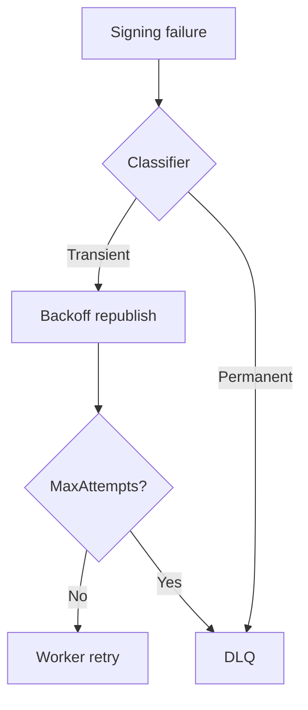

# Operations

Runbook-oriented guidance for health, metrics, retries, timestamping, and incidents.

## Health

```text
/health/live
/health/ready
```

Readiness includes required dependencies (PostgreSQL, RabbitMQ, storage as configured).

## Metrics to watch

- Request / completion / failure rates
- Queue depth and queue wait
- Processing duration
- Provider and storage errors
- Retry count and DLQ depth

## Local infrastructure

```bash
docker compose up -d
docker compose ps
```

RabbitMQ management UI: http://localhost:15672

## Worker retry defaults

| Setting | Typical default |
| --- | --- |
| `MaxAttempts` | 5 |
| Initial backoff | 1s |
| Multiplier | 2 |
| Max backoff | 60s |
| Lock lease | 15 minutes |

Permanent failures go to `esign.signature.dlq` without endless retry.



## Timestamping (RFC 3161)

T/LT/LTA require a TSA. Configure on the worker:

```json
"Timestamping": {
  "Url": "https://tsa.example.invalid/",
  "PolicyOid": ""
}
```

Missing TSA → `TIMESTAMP_AUTHORITY_UNAVAILABLE` (no silent downgrade to B).

## Incident checklist

1. Correlation ID / signature ID / job ID  
2. Provider health  
3. Queue `esign.signature.worker` and DLQ  
4. Storage presence of `input.bin` / `signed.bin`  
5. Machine-readable error code  
6. Retry only if classified transient  

## USB tokens (Development)

With vendor PKCS#11 middleware installed, Development may auto-detect libraries (`Signing:SmartCard:AutoDetect`). Expired token certificates may sign only when `Signing:AllowExpiredCertificates` is true — keep **false** in production.

Full ops notes: [engineering operations source](engineering/operations.md).
