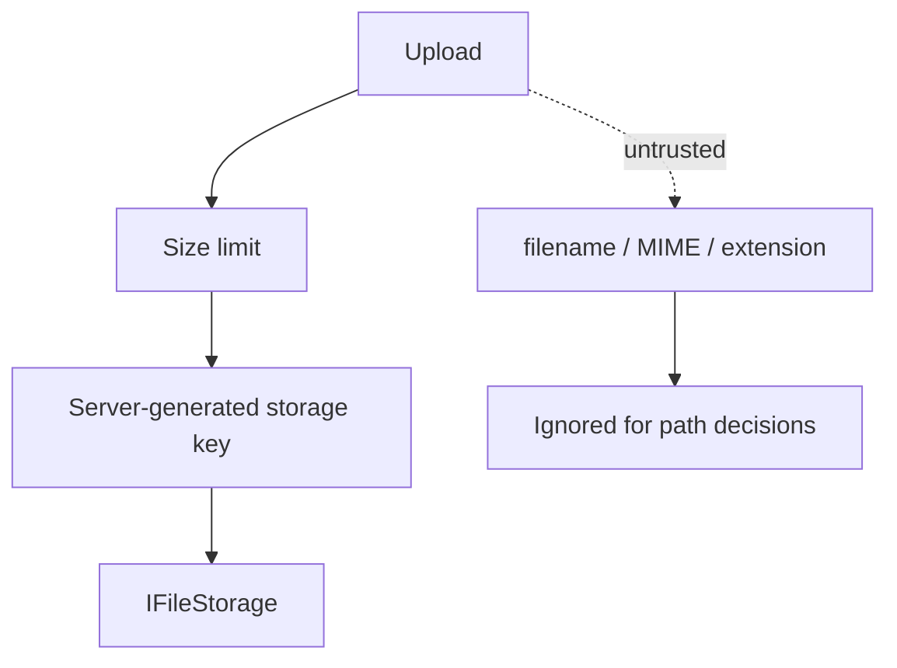

# Security

Security requirements for OpenSignature uploads, secrets, authn/authz, and hardware-backed signing.

## Non-negotiables

- Never commit PFX files, private keys, PINs, HSM credentials, or production API keys.
- Never log secrets, PINs, passwords, or document contents.
- Never put document binaries on RabbitMQ.
- Never export private keys from PKCS#11 / smart-card / HSM providers.
- Never silently downgrade a requested signature profile.

## Secrets

Named secrets resolve through `ISecretStore`:

| Implementation | Use |
| --- | --- |
| `ConfigurationSecretStore` | Dev / user-secrets |
| `EnvironmentSecretStore` | `OPENSIGNATURE_SECRET_{NAME}` |
| `RotatingSecretStore` | Rotation hook over an inner chain |

Signing passwords/PINs/TSA credentials use `ISigningSecretProvider` (`PasswordSecretName` / `PinSecretName` / `Timestamping:PasswordSecretName`).

## Authentication & RBAC

MVP: API keys when `Authentication:Enabled=true`.  
Production roadmap: OAuth2 / OIDC + JWT.

| Role | Capabilities |
| --- | --- |
| Administrator | All policies |
| Signer | Create / cancel; read own status |
| Operator | Status; cancel; provider health |
| Auditor | Read-only status / content |
| Developer | Certificates and providers |

Wrong role → `403` (`AUTH_FORBIDDEN`). Cross-tenant header mismatch → `TENANT_ACCESS_DENIED`.

## File handling



Treat uploads as untrusted. Prevent path traversal. Use safe temp files. TLS in production.

## Hardware signing

Prefer digest-to-device:

```text
certificate → digest → device.Sign(digest)
```

Health checks must not log in with PIN (avoid lockout). Token PIN only via secret name resolution.

## Audit

Audit events capture actor, tenant, entity, correlation id, and safe metadata — not secret material or document bytes.

See also: [engineering security source](engineering/security.md).
