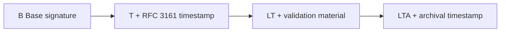

# Signature profiles

OpenSignature targets ETSI AdES profiles. The platform **never silently downgrades** a requested profile.

| Format | B | T | LT | LTA | MVP focus |
| --- | --- | --- | --- | --- | --- |
| PAdES | Yes | Yes | Yes | Yes | B |
| XAdES | Yes | Yes | Yes | Yes | B |
| CAdES | Yes | Yes | Yes | Yes | B |
| ASiC-S | Yes | Yes | Yes | Yes | B |
| ASiC-E | Yes | Yes | Yes | Yes | B |

## Profile meanings

| Profile | Meaning |
| --- | --- |
| **B** | Base cryptographic signature + required certificate attributes |
| **T** | B + trusted RFC 3161 timestamp |
| **LT** | T + certificates and revocation evidence for long-term validation |
| **LTA** | LT + archival timestamp as required by the format profile |

## Fail-closed rules

| Missing dependency | Error |
| --- | --- |
| No TSA for T/LT/LTA | `TIMESTAMP_AUTHORITY_UNAVAILABLE` |
| TSA call fails | `TIMESTAMP_OPERATION_FAILED` |
| No CRL/OCSP for LT/LTA | `SIGNATURE_VALIDATION_DATA_UNAVAILABLE` |

## Format notes (summary)

- **CAdES** — CMS `SignedData`; T/LT/LTA via unsigned attributes; LTA ATS gaps documented in engineering matrix.
- **XAdES** — XMLDSig + XAdES properties; packaging enveloped / enveloping / detached.
- **PAdES** — PDF incremental update, `/SubFilter /ETSI.CAdES.detached`; optional visible widget; DSS for LT; DocTimeStamp for LTA.
- **ASiC** — container with inner CAdES (and related structures).

Detailed gaps and configuration: [engineering signature profiles](engineering/signature-profiles.md).
