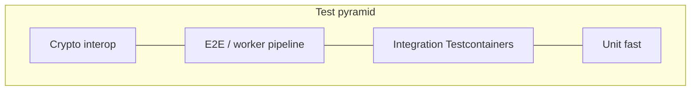

# Testing

How OpenSignature is tested across unit, integration, E2E, and cryptographic interoperability layers.



## Principles

- Deterministic fixtures and clocks where possible
- No secrets or private-key PFX in the repository
- Never log secrets or full document/signature payloads in tests
- Do not fake unsupported profiles — assert rejection instead

## Projects

| Project | Layer |
| --- | --- |
| `OpenSignature.Domain.Tests` | Unit — state machine |
| `OpenSignature.Application.Tests` | Unit — handlers / validators |
| `OpenSignature.Infrastructure.Tests` | Unit + PG integration |
| `OpenSignature.Signing.Tests` | Signing helpers / providers |
| `OpenSignature.Validation.Tests` | Validation pipeline |
| `OpenSignature.Api.IntegrationTests` | API + Problem Details |
| `OpenSignature.Worker.IntegrationTests` | Worker + E2E pipe |
| `OpenSignature.Interop.Tests` | Independent crypto validation |

## E2E happy path

```text
API → storage → PostgreSQL → outbox → RabbitMQ → worker → provider → signed storage → Completed → download
```

## Interop cases

Positive and negative: valid signature, modified document, modified signature, wrong certificate, expired certificate, provider failure.

Run:

```bash
dotnet test OpenSignature.slnx
```

CI (`.github/workflows/ci.yml`) runs the same `dotnet test` on pull requests and `main`, plus web lint/build. After those gates pass on `main`, Api, Worker, and Web images are published to GHCR.

Full strategy: [engineering test strategy](engineering/test-strategy.md).
