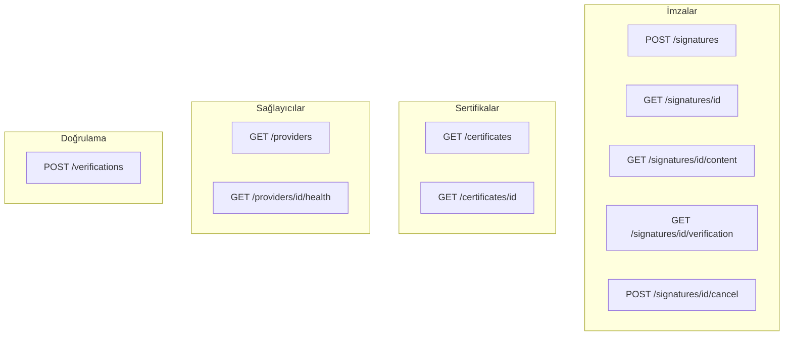
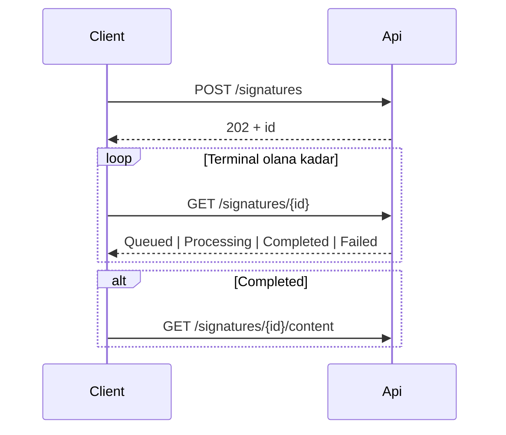

# REST API

Temel yol: `/api/v1`  
OpenAPI (Development/Testing): `GET /openapi/v1.json`

Kriptografik imza API içinde çalışmaz. Oluşturma **`202 Accepted`** döner; işçi işi asenkron tamamlar.

## Ortak başlıklar

| Başlık | Zorunlu | Açıklama |
| --- | --- | --- |
| `Authorization` / `X-Api-Key` | Kimlik doğrulama açıkken | `Authorization: ApiKey <key>` veya `X-Api-Key` |
| `X-Tenant-Id` | Önerilir | Kiracı kapsamı |
| `Idempotency-Key` | Oluşturmada önerilir | Yeniden oynatılabilir oluşturma |
| `X-Correlation-Id` | İsteğe bağlı | Log ve duruma yayılır |

## Hata modeli (RFC 7807)

```json
{
  "type": "https://httpstatuses.com/400",
  "title": "Invalid request",
  "status": 400,
  "detail": "A non-empty 'file' form field is required.",
  "errorCode": "SIGNATURE_REQUEST_INVALID",
  "traceId": "..."
}
```

| Kod | Tipik durum |
| --- | --- |
| `SIGNATURE_REQUEST_INVALID` | 400 / 413 |
| `SIGNATURE_FORMAT_UNSUPPORTED` | 400 |
| `SIGNATURE_PROFILE_UNSUPPORTED` | 400 |
| `SIGNING_PROVIDER_UNAVAILABLE` | 400 |
| `SIGNING_CERTIFICATE_NOT_FOUND` | 400 |
| `SIGNING_CERTIFICATE_EXPIRED` | 422 / iş hatası |
| `SIGNATURE_INPUT_NOT_FOUND` | 404 |
| `SIGNATURE_OUTPUT_NOT_FOUND` | 409 |
| `TIMESTAMP_AUTHORITY_UNAVAILABLE` | iş hatası |
| `SIGNATURE_VALIDATION_DATA_UNAVAILABLE` | iş hatası |

## Uç noktalar



### POST `/api/v1/signatures`

Çok parçalı alanlar: `file`, `format`, `profile`, `signingProvider`, isteğe bağlı `certificateThumbprint`, PAdES görünüm alanları.

Biçimler: `PAdES`, `XAdES`, `CAdES`, `ASiC_S`, `ASiC_E`  
Profiller: `B`, `T`, `LT`, `LTA`  
Sağlayıcılar: `Pfx`, `Pkcs11`, `SmartCard`, `Hsm`

Yanıt `202`:

```json
{
  "id": "0198...",
  "status": "Queued",
  "createdAt": "2026-09-05T17:00:00Z",
  "statusUrl": "/api/v1/signatures/0198..."
}
```

### GET `/api/v1/signatures/{id}`

Durum yoklaması. Tamamlanmamış çıktılar Completed olarak sunulmaz.

### GET `/api/v1/signatures/{id}/content`

**Completed** iken `signed.bin` akışı.

### GET `/api/v1/signatures/{id}/verification`

Saklanmış tamamlanmış imza için JSON doğrulama raporu.

### POST `/api/v1/signatures/{id}/cancel`

Yalnızca imza başlamadan önce güvenilirdir.

### Sertifikalar ve sağlayıcılar

- `GET /api/v1/certificates` — yalnızca genel sertifika meta verisi (özel anahtar yok)
- `GET /api/v1/providers` / `.../health` — keşif ve sağlık

### POST `/api/v1/verifications`

Anlık yükleme doğrulaması (kalıcı saklanmaz).

## İstemci yoklama döngüsü



Alan düzeyinde sözleşme: [mühendislik API kaynağı](engineering/api.md).
