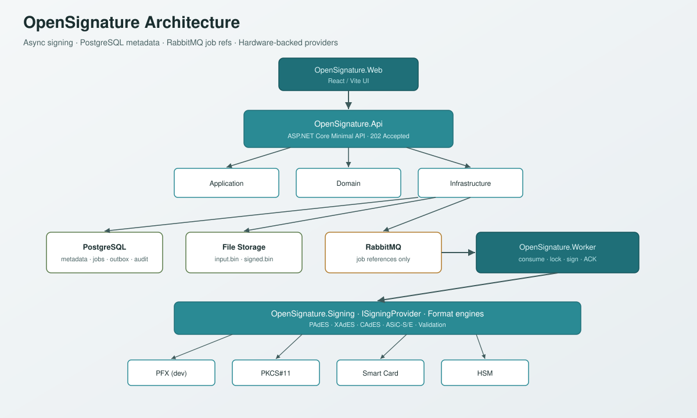
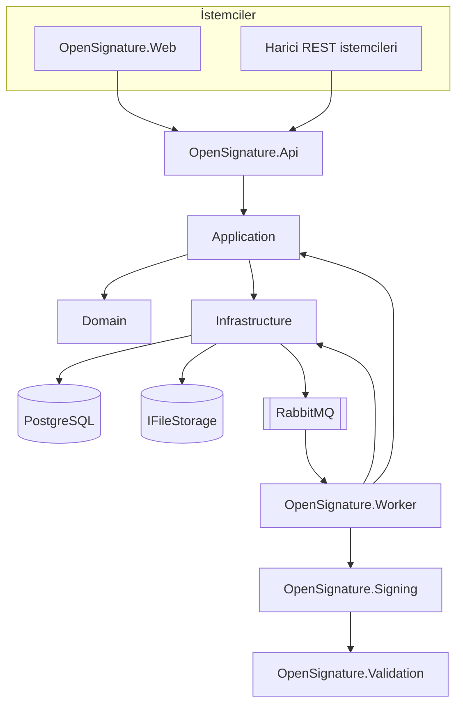
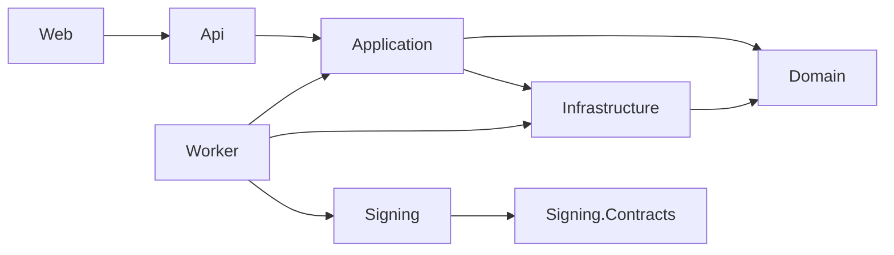
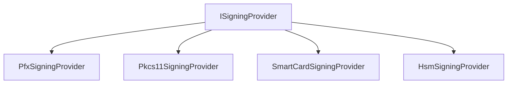
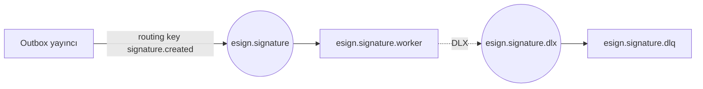

# Mimari

**OpenSignature** mühendislik mimarisi. Ürün kuralları [ürün spesifikasyonunda](product-spec.md) ve `docs/TASKS.md` içindedir.

{ .architecture-hero }

## Hedefler

- Biçimler: PAdES, XAdES, CAdES, ASiC-S, ASiC-E (B → T → LT → LTA).
- API senkron imza atmaz.
- Kriptografi değiştirilebilir `ISigningProvider` arkasındadır.
- İkili dosyalar dosya/nesne depolamada; PostgreSQL meta veri, iş, denetim, outbox tutar.
- RabbitMQ yalnızca iş referanslarını taşır.
- Kiracı izolasyonu, idempotency, uçtan uca OpenTelemetry.

## Bileşen haritası

| Proje | Rol |
| --- | --- |
| `OpenSignature.Web` | React yönetim / demo arayüzü |
| `OpenSignature.Api` | HTTP sınırı; doğrulama; `202 Accepted` |
| `OpenSignature.Application` | Kullanım senaryoları, DTO’lar, portlar |
| `OpenSignature.Domain` | Varlıklar, durum makinesi — altyapı yok |
| `OpenSignature.Infrastructure` | EF Core, PostgreSQL, depolama, RabbitMQ, outbox |
| `OpenSignature.Signing.Contracts` | `ISigningProvider` ve ortak sözleşmeler |
| `OpenSignature.Signing` | Sağlayıcılar ve biçim motorları |
| `OpenSignature.Validation` | Sertifika + imza doğrulama raporları |
| `OpenSignature.Worker` | İşleri tüketir; imzalar; durumu günceller |



## Bağımlılık kuralları



- **Domain** kendi dışına bağımlı değildir.
- **Signing** RabbitMQ’ya bağımlı olmamalıdır.
- **Api** kriptografik imza yapmamalıdır.
- Port tercih edin: `IFileStorage`, `ISigningProvider`, mesajlaşma soyutlamaları.

## İmza sağlayıcıları



Donanım kuralı:

```text
certificate → digest → device.Sign(digest)
```

Özel anahtarlar token/HSM’den çıkmaz. PFX yalnızca geliştirme/demo içindir.

## Depolama anahtarları

Sunucu üretir (istemci dosya adları kullanılmaz):

```text
tenants/{tenantId}/signatures/{yyyy}/{MM}/{dd}/{signatureId}/input.bin
tenants/{tenantId}/signatures/{yyyy}/{MM}/{dd}/{signatureId}/signed.bin
```

## RabbitMQ topolojisi



Mesajlar `jobId`, `tenantId`, `signatureId`, depolama yolları, biçim/profil, deneme taşır — **dosya baytları değil**.

## Outbox deseni

1. Aynı PostgreSQL işleminde: imza meta verisi + iş + `OutboxMessage`.
2. Yayıncı yayımlanmamış satırları RabbitMQ’ya boşaltır.
3. Yalnızca broker tesliminden sonra `PublishedAt` işaretlenir.
4. İşçi tüketimi idempotenttir (iş kilidi + terminal durum kontrolleri).

## Çok kiracılılık

- Varlıklar ve mesajlar `TenantId` içerir.
- Idempotency anahtarı = `TenantId + Idempotency-Key`.
- Kimlik doğrulama yolu: MVP API anahtarları; üretim OAuth2/OIDC + JWT + RBAC.

## Gözlemlenebilirlik

Her adımda `correlationId`, `traceId`, `signatureId`, `jobId` taşınmalıdır.

Özel anahtarlar, PIN’ler, parolalar, sırlar veya belge içerikleri asla loglanmaz.

## İlgili

- [Akışlar ve diyagramlar](flows.md)
- [Güvenlik](security.md)
- [Mühendislik mimari kaynağı](engineering/architecture.md)
