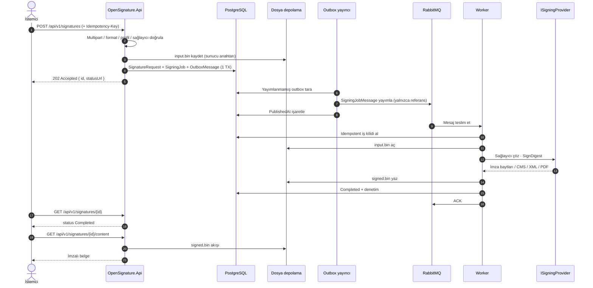
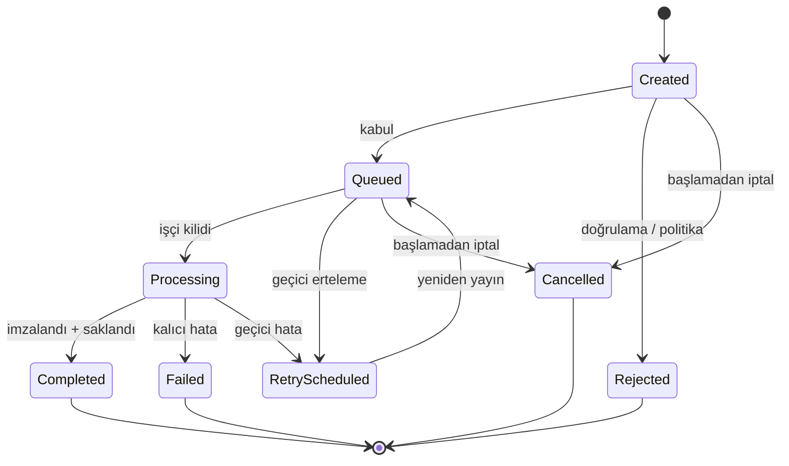
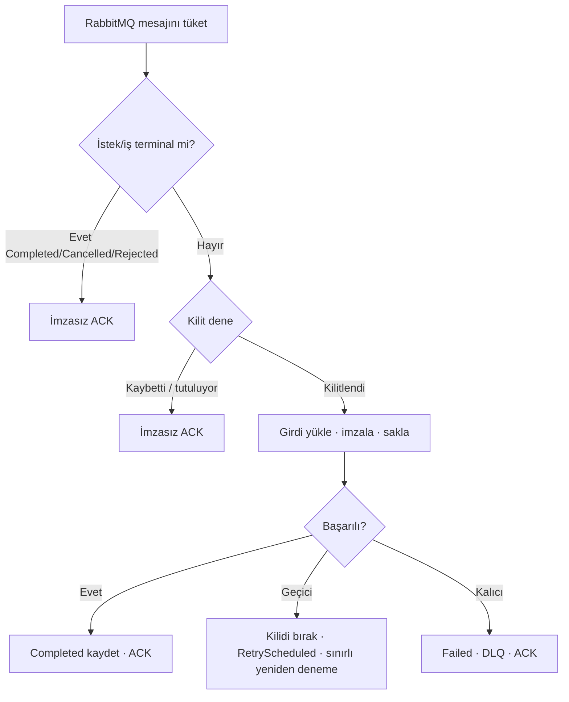
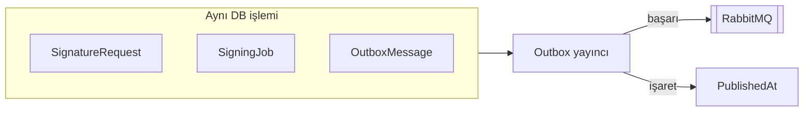
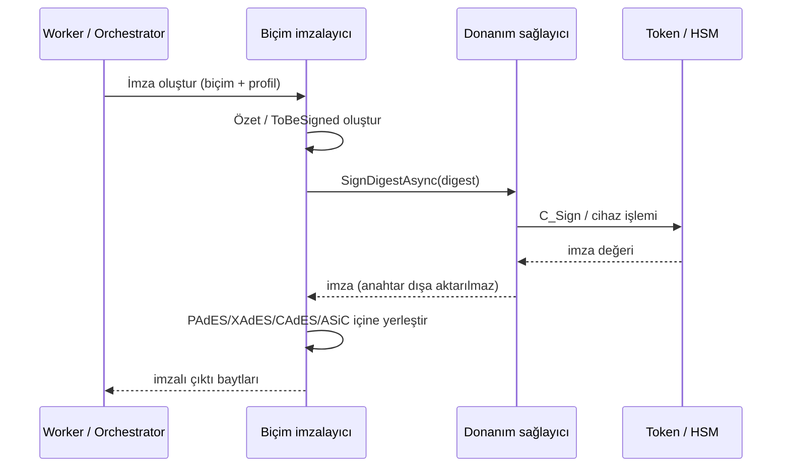
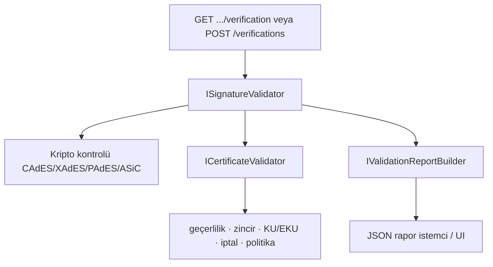

# Akışlar ve diyagramlar

OpenSignature istek işleme, durum makineleri, outbox güvenilirliği ve sağlayıcı imzalama için görsel referans.

{ .architecture-hero }

## Uçtan uca imza sırası

## İmza isteği durum makinesi

Terminal durumlar: **Completed**, **Failed**, **Rejected**, **Cancelled**.

## İşçi kilidi ve idempotency

Kurallar:

- En az bir kez teslimat, yinelenen başarılı imza üretmemelidir.
- Kilit süresi beklenen imza süresinden uzun olmalıdır (varsayılan 15 dakika).
- Çökme sonrası süresi dolmuş `Locked`/`Processing` geri alınabilir; aktif kilitler çalınmaz.

## Outbox güvenilirliği

PostgreSQL ile broker arasında çift yazım kaybını önler.

## Sağlayıcı özet-imza akışı

## Doğrulama akışı

## Yeniden deneme ve DLQ

| Hata sınıfı | Davranış |
| --- | --- |
| Geçici (ağ, TSA zaman aşımı, kilit yarışı) | Üstel geri çekilme; sınırlı `MaxAttempts` |
| Kalıcı (bozuk yük, kripto hatası, okunamayan PDF) | Hemen DLQ; sonsuz yeniden deneme yok |

DLQ: `esign.signature.dlq` ← `esign.signature.dlx`.

