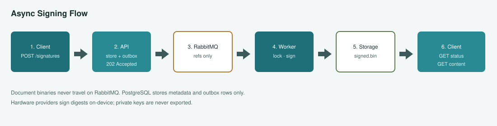
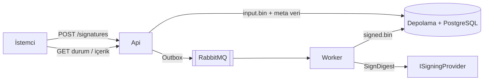

# OpenSignature

**OpenSignature**, kurumsal PAdES, XAdES, CAdES ve ASiC iş akışları için bağımsız bir .NET dijital imza platformudur. İstemciler belgeleri REST üzerinden gönderir; imzalama işçi süreçlerinde asenkron çalışır. PostgreSQL meta veriyi saklar; dosya depolama ikili dosyaları tutar; RabbitMQ yalnızca iş referanslarını taşır.

{ .architecture-hero }

Sistem genel bakışı — API, depolama, kuyruk, işçi ve imza sağlayıcıları.

## Mimari ilkeler

| İlke | Uygulama |
| --- | --- |
| Engellemesiz API | Doğrula → kaydet → outbox → `202 Accepted`. API sürecinde kriptografi yok. |
| Güvenli taşıma | RabbitMQ mesajları küçük JSON iş referanslarıdır — belge ikilileri asla yok. |
| Anahtar hijyeni | Donanım sağlayıcıları özeti cihazda imzalar; özel anahtarlar dışa aktarılmaz. |
| Kiracı izolasyonu | Depolama anahtarları, idempotency ve sorgular `TenantId` ile sınırlıdır. |
| Gözlemlenebilirlik | Her adımda correlation / trace / signature / job kimlikleri. |

## Hızlı bağlantılar

- [Başlangıç](getting-started.md) — yerel Docker, API, işçi, arayüz
- [Mimari](architecture.md) — bileşenler ve bağımlılık kuralları
- [Akışlar ve diyagramlar](flows.md) — sıra ve durum diyagramları
- [REST API](api.md) — uç noktalar ve hata kodları
- [Ürün spesifikasyonu](product-spec.md) — mühendislik kaynağı

## Asenkron imzalama özeti

{ .architecture-hero }

## Dil

Bu site **English** ve **Türkçe** olarak sunulur (üst çubuktaki dil seçici). Kaynak kodu, tanımlayıcılar, loglar, testler ve commit mesajları yalnızca İngilizcedir.

## Lisans

OpenSignature [MIT Lisansı](https://github.com/serhatboyraz/opensignature/blob/main/LICENSE) altındadır.
