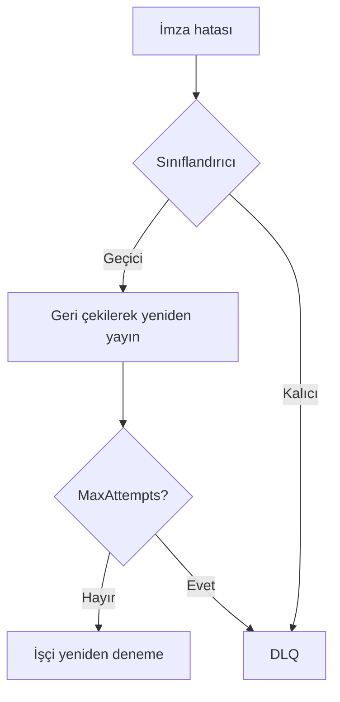

# Operasyon

Sağlık, metrikler, yeniden denemeler, zaman damgası ve olay müdahalesi için işletim kılavuzu.

## Sağlık

```text
/health/live
/health/ready
```

Hazırlık, yapılandırılmış bağımlılıkları (PostgreSQL, RabbitMQ, depolama) içermelidir.

## İzlenecek metrikler

- İstek / tamamlanma / hata oranları
- Kuyruk derinliği ve bekleme süresi
- İşleme süresi
- Sağlayıcı ve depolama hataları
- Yeniden deneme sayısı ve DLQ derinliği

## Yerel altyapı

```bash
docker compose up -d
docker compose ps
```

RabbitMQ yönetim arayüzü: http://localhost:15672

## İşçi yeniden deneme varsayılanları

| Ayar | Tipik varsayılan |
| --- | --- |
| `MaxAttempts` | 5 |
| İlk geri çekilme | 1s |
| Çarpan | 2 |
| Maks. geri çekilme | 60s |
| Kilit süresi | 15 dakika |

Kalıcı hatalar sonsuz yeniden deneme olmadan `esign.signature.dlq` kuyruğuna gider.



## Zaman damgası (RFC 3161)

T/LT/LTA bir TSA gerektirir. İşçide yapılandırın:

```json
"Timestamping": {
  "Url": "https://tsa.example.invalid/",
  "PolicyOid": "",
  "Username": "",
  "PasswordSecretName": "Timestamping:Password"
}
```

Eksik TSA → `TIMESTAMP_AUTHORITY_UNAVAILABLE` (B’ye sessiz düşüş yok).  
HTTP Basic Auth: `Username` doldurun; parolayı user secrets / `PasswordSecretName` ile verin. Anonim TSA için `Username` boş kalsın.

## Olay kontrol listesi

1. Correlation / signature / job kimliği  
2. Sağlayıcı sağlığı  
3. `esign.signature.worker` ve DLQ  
4. `input.bin` / `signed.bin` varlığı  
5. Makine okunabilir hata kodu  
6. Yalnızca geçici hatalarda yeniden deneme  

## USB token (Development)

Satıcı PKCS#11 ara yazılımı kuruluysa Development otomatik algılama yapabilir (`Signing:SmartCard:AutoDetect`). Süresi dolmuş sertifikalar yalnızca `Signing:AllowExpiredCertificates=true` iken imzalayabilir — üretimde **false** tutun.

Tam operasyon notları: [mühendislik operasyon kaynağı](engineering/operations.md).
