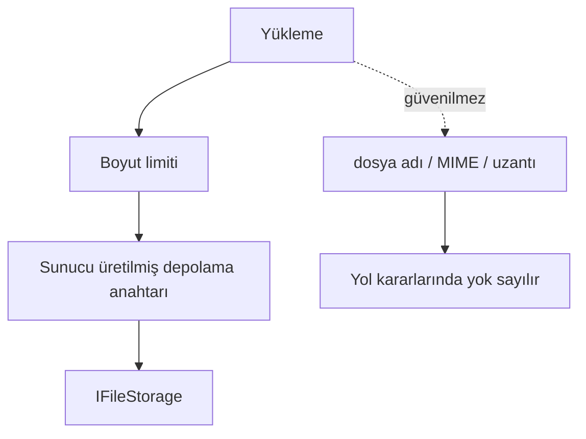

# Güvenlik

OpenSignature yüklemeleri, sırlar, kimlik doğrulama/yetkilendirme ve donanım destekli imza için güvenlik gereksinimleri.

## Pazarlık edilmez kurallar

- PFX, özel anahtar, PIN, HSM kimlik bilgisi veya üretim API anahtarı commit edilmez.
- Sırlar, PIN’ler, parolalar veya belge içerikleri loglanmaz.
- Belge ikilileri RabbitMQ’ya konmaz.
- PKCS#11 / akıllı kart / HSM’den özel anahtar dışa aktarılmaz.
- İstenen imza profili sessizce düşürülmez.

## Sırlar

Adlandırılmış sırlar `ISecretStore` üzerinden çözülür:

| Uygulama | Kullanım |
| --- | --- |
| `ConfigurationSecretStore` | Geliştirme / user-secrets |
| `EnvironmentSecretStore` | `OPENSIGNATURE_SECRET_{NAME}` |
| `RotatingSecretStore` | İç zincir üzerinde rotasyon kancası |

İmza parola/PIN’leri `ISigningSecretProvider` kullanır (`PasswordSecretName` / `PinSecretName`).

## Kimlik doğrulama ve RBAC

MVP: `Authentication:Enabled=true` iken API anahtarları.  
Üretim yolu: OAuth2 / OIDC + JWT.

| Rol | Yetkinlikler |
| --- | --- |
| Administrator | Tüm politikalar |
| Signer | Oluştur / iptal; kendi durumunu oku |
| Operator | Durum; iptal; sağlayıcı sağlığı |
| Auditor | Salt okunur durum / içerik |
| Developer | Sertifikalar ve sağlayıcılar |

Yanlış rol → `403` (`AUTH_FORBIDDEN`). Kiracı uyuşmazlığı → `TENANT_ACCESS_DENIED`.

## Dosya işleme



Yüklemeleri güvenilmez kabul edin. Yol kaçışını engelleyin. Üretimde TLS kullanın.

## Donanım imzalama

Özet-cihaz akışını tercih edin:

```text
certificate → digest → device.Sign(digest)
```

Sağlık kontrolleri PIN ile oturum açmamalıdır (kilitlenmeyi önlemek için).

Ayrıca: [mühendislik güvenlik kaynağı](engineering/security.md).
