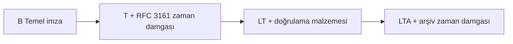

# İmza profilleri

OpenSignature ETSI AdES profillerini hedefler. Platform istenen profili **sessizce düşürmez**.

| Biçim | B | T | LT | LTA | MVP odak |
| --- | --- | --- | --- | --- | --- |
| PAdES | Evet | Evet | Evet | Evet | B |
| XAdES | Evet | Evet | Evet | Evet | B |
| CAdES | Evet | Evet | Evet | Evet | B |
| ASiC-S | Evet | Evet | Evet | Evet | B |
| ASiC-E | Evet | Evet | Evet | Evet | B |

## Profil anlamları

| Profil | Anlam |
| --- | --- |
| **B** | Temel kriptografik imza + gerekli sertifika öznitelikleri |
| **T** | B + güvenilir RFC 3161 zaman damgası |
| **LT** | T + uzun vadeli doğrulama için sertifika ve iptal kanıtı |
| **LTA** | LT + biçim profilinin gerektirdiği arşiv zaman damgası |

## Kapalı hata kuralları

| Eksik bağımlılık | Hata |
| --- | --- |
| T/LT/LTA için TSA yok | `TIMESTAMP_AUTHORITY_UNAVAILABLE` |
| TSA çağrısı başarısız | `TIMESTAMP_OPERATION_FAILED` |
| LT/LTA için CRL/OCSP yok | `SIGNATURE_VALIDATION_DATA_UNAVAILABLE` |

## Biçim notları (özet)

- **CAdES** — CMS `SignedData`; T/LT/LTA unsigned öznitelikler.
- **XAdES** — XMLDSig + XAdES özellikleri; enveloped / enveloping / detached.
- **PAdES** — PDF artımlı güncelleme; isteğe bağlı görünür damga; mevcut imzanın üzerine basmak yerine yeni imza eklenir; LT için DSS; LTA için DocTimeStamp.
- **ASiC** — iç CAdES içeren konteyner.

Ayrıntılı boşluklar: [mühendislik imza profilleri](engineering/signature-profiles.md).
