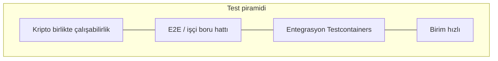

# Test stratejisi

OpenSignature’ın birim, entegrasyon, E2E ve kriptografik birlikte çalışabilirlik katmanlarında nasıl test edildiği.



## İlkeler

- Mümkün olduğunca deterministik fikstürler
- Depoda sır veya özel anahtarlı PFX yok
- Testlerde sır veya tam belge/imza yükü loglanmaz
- Desteklenmeyen profilleri taklit etmeyin — reddi doğrulayın

## Projeler

| Proje | Katman |
| --- | --- |
| `OpenSignature.Domain.Tests` | Birim — durum makinesi |
| `OpenSignature.Application.Tests` | Birim — işleyiciler / doğrulayıcılar |
| `OpenSignature.Infrastructure.Tests` | Birim + PG entegrasyon |
| `OpenSignature.Signing.Tests` | İmza yardımcıları / sağlayıcılar |
| `OpenSignature.Validation.Tests` | Doğrulama boru hattı |
| `OpenSignature.Api.IntegrationTests` | API + Problem Details |
| `OpenSignature.Worker.IntegrationTests` | İşçi + E2E |
| `OpenSignature.Interop.Tests` | Bağımsız kripto doğrulama |

## E2E mutlu yol

```text
API → depolama → PostgreSQL → outbox → RabbitMQ → işçi → sağlayıcı → imzalı depolama → Completed → indirme
```

Çalıştırma:

```bash
dotnet test OpenSignature.slnx
```

Tam strateji: [mühendislik test stratejisi](engineering/test-strategy.md).
